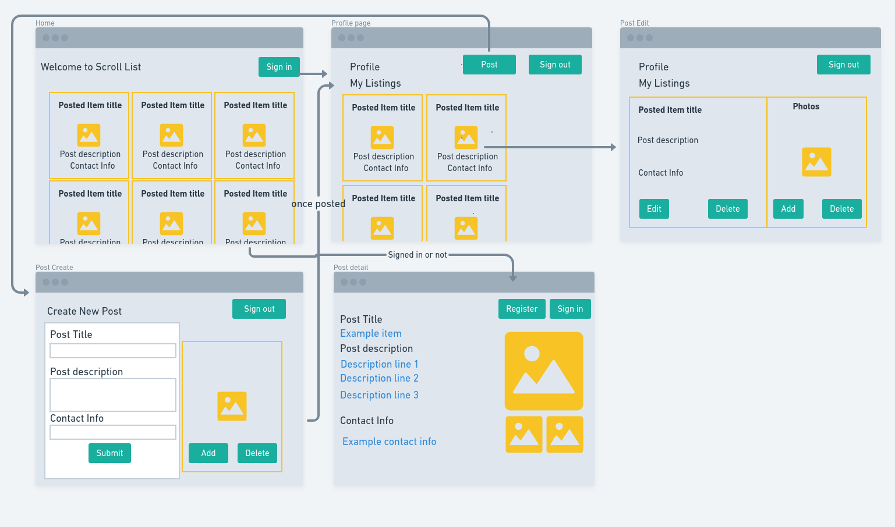

# Technology used:

MERN: MongoDB, Express, React, NodeJS.

# User Story:

Scroll List is a simple application which allows users to:

1. Navigate through the posted listings easily in home page viewing all posts.

# Stretch Goals 

Add Categories, enable offers, bring in paypal donate link.

# MVP Pitch with scope

    1. Get approval for Project Scroll List based on:
        Wire frame.
        ERD.
        User Stories.
        Milestones.

    2. Gather and define requirements for MERN application, git hub set up, install npm packages.

    3. Create the backend mongoose data base and test the data using insomnia.

    4. Build the front end using react and have a basic crud functionality with minimum styling.

    5. Bring in the Api's and use the data within the app.
   
    7. Lunch the app using Heroku.

# MileStones

    Implementing full stack MERN app, setting up Mongo database and use react on front end. 

    